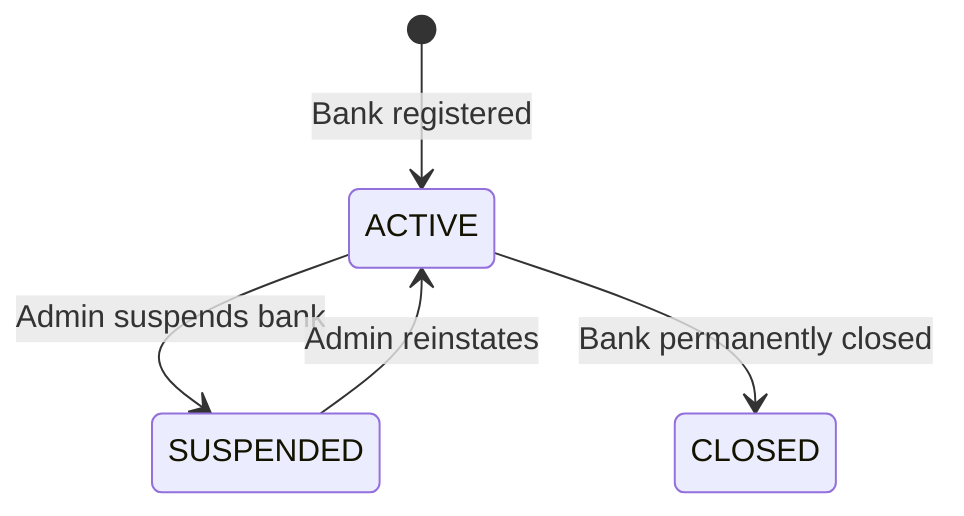
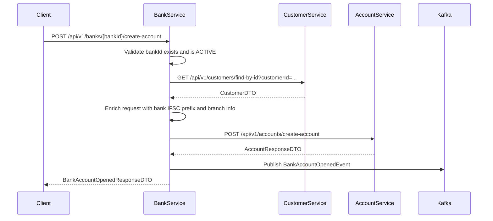

# Bank Service — Design Document

## Overview

The **Bank Service** is the administrative core of the Bank Management System. It manages the registration and configuration of bank branches, and acts as the **orchestration hub** that creates bank accounts for customers by calling the Account Service via Feign. It is the single entry point for any bank-level operations such as registering a new branch, retrieving bank/branch info, and opening customer accounts linked to a specific branch.

---

## Responsibilities

| Responsibility | Description |
|---|---|
| **Bank Registration** | Register a new bank with name, code, headquarters, and contact info |
| **Branch Management** | Track branches with IFSC code, city, and address |
| **Account Creation** | Orchestrate account opening by calling `account-service` via Feign |
| **Customer Validation** | Validate customer existence via `customer-service` Feign call |
| **Notifications** | Publish Kafka events when a bank is registered or an account is opened |

---

## Bank Entity State Machine



---

## API Endpoints

| Method | Endpoint | Description |
|--------|----------|-------------|
| `POST` | `/api/v1/banks/register` | Register a new bank |
| `GET` | `/api/v1/banks/{bankId}` | Get bank details by ID |
| `GET` | `/api/v1/banks/code/{bankCode}` | Get bank by IFSC bank code |
| `GET` | `/api/v1/banks` | List all registered banks |
| `PUT` | `/api/v1/banks/{bankId}/status` | Update bank status (ACTIVE/SUSPENDED/CLOSED) |
| `POST` | `/api/v1/banks/{bankId}/create-account` | Create a bank account for a customer via account-service |
| `DELETE` | `/api/v1/banks/{bankId}` | Delete a bank record |

---

## Entity Model — `Bank`

| Field | Type | Description |
|-------|------|-------------|
| `bankId` | `UUID` | Primary key |
| `bankName` | `String` | Full name of the bank (e.g., "State Bank of India") |
| `bankCode` | `String` | Unique short code (e.g., "SBIN") |
| `headquartersCity` | `String` | City where HQ is located |
| `ifscPrefix` | `String` | First 4 chars of all IFSC codes under this bank |
| `contactEmail` | `String` | Bank's contact email |
| `contactPhone` | `String` | Bank's contact number |
| `bankStatus` | `BankStatus` | ACTIVE / SUSPENDED / CLOSED |
| `createdAt` | `LocalDateTime` | Record creation timestamp |
| `updatedAt` | `LocalDateTime` | Last update timestamp |

---

## `createAccount()` — Integration Flow

This is the key method that links **bank-service → account-service**.



### Step-by-Step Logic

1. **Validate Bank** — check `bankId` exists and `bankStatus == ACTIVE`
2. **Fetch Customer** — call `customer-service` via Feign to verify customer exists
3. **Enrich Request** — auto-fill `ifscCode` from bank's `ifscPrefix` + branch suffix, `branchName` from bank record
4. **Delegate to Account Service** — call `account-service` via Feign (`POST /api/v1/accounts/create-account`) with `AccountRequestDTO`
5. **Publish Kafka Event** — emit `BankAccountOpenedEvent` to `bank-account-opened-topic`
6. **Return Response** — wrap `AccountResponseDTO` into `BankAccountOpenedResponseDTO`

---

## Cross-Service Interactions

| Service | Via | Purpose |
|---------|-----|---------|
| Customer Service | Feign | Validate customer exists before account creation |
| Account Service | Feign | Delegate actual account creation |
| Notification Service | Kafka | Notify on bank registration & account opening |

---

## Kafka Topics (new)

| Topic | Event | Published When |
|-------|-------|----------------|
| `bank-registration-topic` | `BankRegistrationEvent` | New bank registered |
| `bank-account-opened-topic` | `BankAccountOpenedEvent` | Account created via bank-service |

---

## Files to Create

```
bank-service/src/main/java/com/bank/
├── BankServiceApp.java                         ← @SpringBootApplication + @EnableFeignClients
├── ENUM/
│   └── BankStatus.java                         ← ACTIVE, SUSPENDED, CLOSED
├── model/
│   └── Bank.java                               ← JPA entity
├── repository/
│   └── BankRepository.java
├── dto/
│   ├── BankRequestDTO.java
│   ├── BankResponseDTO.java
│   ├── BankAccountRequestDTO.java              ← customerId + accountType + balance
│   └── BankAccountOpenedResponseDTO.java       ← wraps AccountResponseDTO + bankId
├── feign/
│   ├── CustomerFeignService.java
│   └── AccountFeignService.java
├── service/
│   └── BankService.java                        ← core logic + createAccount()
├── controller/
│   └── BankController.java
└── exception/
    └── ResourceNotFoundException.java

common-lib additions:
└── event/
    ├── BankRegistrationEvent.java
    └── BankAccountOpenedEvent.java

common-lib/config/KafkaConstants.java:
    ← BANK_REGISTRATION_TOPIC, BANK_ACCOUNT_OPENED_TOPIC
```

---

## Port Assignment

| Service | Port |
|---------|------|
| customer-service | 8080 |
| account-service | 8081 |
| loan-service | 8083 |
| credit-card-service | 8085 |
| **bank-service** | **8086** |
