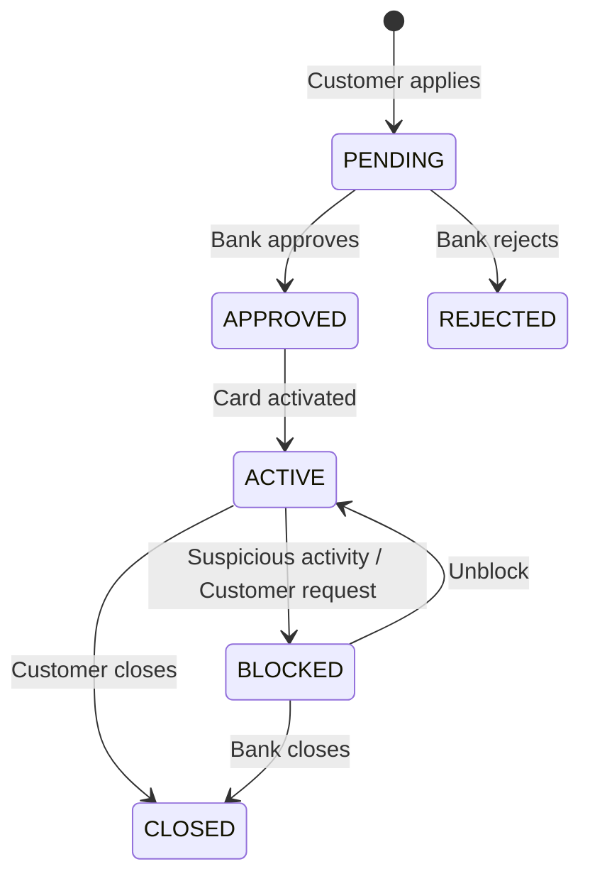

# Credit Card Service — Design Document

## Overview

The Credit Card Service manages the full lifecycle of credit cards within the Bank Management System — from application through approval, activation, transactions (charges/payments), and blocking/closing.

## Credit Card State Machine



## API Endpoints

| Method | Endpoint | Description |
|--------|----------|-------------|
| `POST` | `/api/v1/credit-cards/apply` | Apply for a new credit card |
| `PUT` | `/api/v1/credit-cards/{cardId}/approve` | Approve a pending application |
| `PUT` | `/api/v1/credit-cards/{cardId}/reject` | Reject a pending application |
| `PUT` | `/api/v1/credit-cards/{cardId}/activate` | Activate an approved card |
| `PUT` | `/api/v1/credit-cards/{cardId}/block` | Block an active card |
| `PUT` | `/api/v1/credit-cards/{cardId}/unblock` | Unblock a blocked card |
| `PUT` | `/api/v1/credit-cards/{cardId}/close` | Close a card permanently |
| `POST` | `/api/v1/credit-cards/{cardId}/charge` | Make a purchase/charge |
| `POST` | `/api/v1/credit-cards/{cardId}/payment` | Make a payment toward balance |
| `GET` | `/api/v1/credit-cards/{cardId}` | Get card details |
| `GET` | `/api/v1/credit-cards/customer/{customerId}` | Get all cards for a customer |

## Entity Model — `CreditCard`

| Field | Type | Description |
|-------|------|-------------|
| `cardId` | `UUID` | Primary key |
| `cardNumber` | `String` | Masked 16-digit card number (stored hashed, last 4 visible) |
| `customerId` | `UUID` | FK to Customer Service |
| `accountNumber` | `String` | Linked bank account for payments |
| `cardHolderName` | `String` | Name printed on card |
| `creditLimit` | `BigDecimal` | Max credit limit |
| `availableLimit` | `BigDecimal` | Remaining available credit |
| `outstandingBalance` | `BigDecimal` | Current unpaid balance |
| `minimumDueAmount` | `BigDecimal` | Minimum payment due |
| `annualFee` | `BigDecimal` | Yearly card fee |
| `interestRate` | `Double` | APR for outstanding balance |
| `cardStatus` | `CardStatus` | Current state of the card |
| `expiryDate` | `LocalDate` | Card expiry date |
| `billingCycleDay` | `Integer` | Day of month for billing (1-28) |
| `createdAt` | `LocalDateTime` | Record creation timestamp |
| `updatedAt` | `LocalDateTime` | Last update timestamp |

## Cross-Service Interactions

| Service | Via | Purpose |
|---------|-----|---------|
| Customer Service | Feign | Validate customer exists |
| Account Service | Feign | Validate linked account, process payments |
| Notification Service | Kafka | Card approved/rejected/blocked alerts |
| Transaction Service | Kafka | Record charge/payment transactions |

## Kafka Topics (new)

| Topic | Event | Published When |
|-------|-------|---------------|
| `credit-card-application-topic` | `CreditCardApplicationEvent` | New card applied |
| `credit-card-status-topic` | `CreditCardStatusEvent` | Status changes (approved/blocked/closed) |
| `credit-card-transaction-topic` | `CreditCardTransactionEvent` | Charges and payments |

## Files to Create

```
credit-card-service/src/main/java/com/bank/
├── App.java                          (update — add @EnableFeignClients)
├── ENUM/
│   └── CardStatus.java
├── model/
│   └── CreditCard.java
├── repository/
│   └── CreditCardRepository.java
├── dto/
│   ├── CreditCardRequestDTO.java
│   ├── CreditCardResponseDTO.java
│   └── CreditCardTransactionDTO.java
├── feign/
│   ├── AccountFeignService.java
│   └── CustomerFeignService.java
├── service/
│   └── CreditCardService.java
└── controller/
    └── CreditCardController.java

common-lib additions:
├── config/KafkaConstants.java        (add new topics)
└── event/
    ├── CreditCardApplicationEvent.java
    ├── CreditCardStatusEvent.java
    └── CreditCardTransactionEvent.java
```
