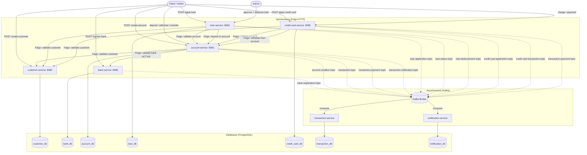

# Bank Management System — Data Flow

> This document traces how data moves through the system for every major user action.
> **Feign = synchronous HTTP** · **Kafka = asynchronous event**

---

## Flow 1 — Register a Bank

```
Client
  │
  │  POST /api/v1/banks/register
  ▼
bank-service
  │  validate unique bankCode
  │  persist Bank entity → bank_db
  │
  │  [Kafka ASYNC]
  └──► bank-registration-topic ──► notification-service (future listener)
  │
  └──► 201 BankResponseDTO → Client
```

**Data stored:** `bank_db.bank` — bankId, bankName, bankCode, ifscPrefix, bankStatus=ACTIVE

---

## Flow 2 — Create a Customer

```
Client
  │
  │  POST /api/v1/customers/create-customer
  ▼
customer-service
  │  validate unique email + mobileNumber
  │  persist Customer → customer_db
  │
  └──► 201 CustomerDTO → Client
```

**Data stored:** `customer_db.customer` — customerId, firstName, lastName, email, mobileNumber

---

## Flow 3 — Open a Bank Account

```
Client
  │
  │  POST /api/v1/accounts/create-account
  │  { customerId, bankId, accountType, ifscCode, branchName, balance }
  ▼
account-service
  │
  │  [Feign SYNC] GET /api/v1/customers/find-by-id?customerId=...
  ├──► customer-service ──► customer_db
  │    ◄── CustomerDTO (name, email, mobile)
  │
  │  [Feign SYNC] GET /api/v1/banks/{bankId}
  ├──► bank-service ──► bank_db
  │    ◄── BankDTO (bankStatus must be ACTIVE)
  │
  │  generate 12-digit accountNumber
  │  persist Account → account_db (with bankId FK)
  │
  │  [Kafka ASYNC] ─────────────────────────────────┐
  │   transaction-topic                             │
  ├──────────────────────────────────────────────►  transaction-service
  │   account-creation-topic                        │  └─► persist Transaction (DEPOSIT)
  └──────────────────────────────────────────────►  notification-service
       ◄── persists Notification (ACCOUNT_CREATED)  │
  │
  └──► 201 AccountResponseDTO → Client
```

**Data stored:**
- `account_db.account` — accountId, customerId, bankId, accountNumber, balance, status=ACTIVE
- `transaction_db.transaction` — initial deposit record
- `notification_db.notification` — ACCOUNT_CREATED notification

---

## Flow 4 — Deposit / Withdraw

```
Client
  │
  │  PUT /api/v1/accounts/{accountNumber}/depositCredit
  │  Header: Idempotency-key: <unique-key>
  │  ?amount=5000
  ▼
account-service
  │
  │  insert idempotency key → account_db.idempotency_request (IN_PROGRESS)
  │    (if duplicate key exists → return cached state, no re-processing)
  │
  │  fetch Account → update balance
  │  persist Account → account_db
  │  mark idempotency key COMPLETED
  │
  │  [Kafka ASYNC] ─────────────────────────────────┐
  │   transaction-notification-topic                │
  ├──────────────────────────────────────────────►  notification-service
  │    ◄── persists Notification (DEPOSIT)          │
  │   transaction-payment-topic                     │
  └──────────────────────────────────────────────►  transaction-service
       ◄── persists Transaction (DEPOSIT)           │
  │
  └──► 200 AccountResponseDTO → Client
```

> Withdraw follows the same pattern with an additional balance-check before update.

---

## Flow 5 — Transfer Between Accounts

```
Client
  │
  │  PUT /api/v1/accounts/transfer-amount
  │  Header: Idempotency-key: <unique-key>
  │  { sourceAccountNumber, destinationAccountNumber, amount }
  ▼
account-service
  │
  │  insert idempotency key (IN_PROGRESS)
  │  fetch sourceAccount + destinationAccount
  │  check sourceAccount.balance >= amount
  │  sourceAccount.balance -= amount
  │  destinationAccount.balance += amount
  │  save both accounts → account_db
  │  mark idempotency key COMPLETED
  │
  │  [Kafka ASYNC] ─────────────────────────────────┐
  │   transaction-notification-topic (x2)           │
  ├──────────────────────────────────────────────►  notification-service
  │    ◄── WITHDRAWAL (source) + DEPOSIT (dest)     │
  │   transaction-payment-topic                     │
  └──────────────────────────────────────────────►  transaction-service
       ◄── persists Transaction (TRANSFER)          │
  │
  └──► 200 AccountResponseDTO (source) → Client
```

---

## Flow 6 — Apply for a Loan

```
Client
  │
  │  POST /api/v1/loans/apply
  │  { customerId, accountNumber, loanAmount, tenureMonths }
  ▼
loan-service
  │
  │  [Feign SYNC] GET /api/v1/customers/find-by-id?customerId=...
  ├──► customer-service ──► customer_db
  │    ◄── CustomerDTO
  │
  │  [Feign SYNC] GET /api/v1/accounts/get-account-by-account-number
  ├──► account-service ──► account_db
  │    ◄── AccountResponseDTO (must be ACTIVE)
  │
  │  persist Loan → loan_db (status=PENDING)
  │
  │  [Kafka ASYNC]
  └──► loan-application-topic ──► notification-service
       ◄── persists Notification (LOAN_APPLIED)
  │
  └──► 201 LoanResponseDTO → Client
```

---

## Flow 7 — Approve & Disburse a Loan

```
Admin
  │
  │  PUT /api/v1/loans/{loanId}/approve
  ▼
loan-service
  │  fetch Loan (must be PENDING)
  │  calculate EMI using formula
  │  update Loan → status=APPROVED, emiAmount set
  │
  │  [Kafka ASYNC]
  └──► loan-status-topic ──► notification-service (LOAN_APPROVED)
  │
  └──► 200 LoanResponseDTO → Admin

  ┄┄┄ (separate admin action) ┄┄┄

Admin
  │
  │  PUT /api/v1/loans/{loanId}/disburse
  ▼
loan-service
  │  fetch Loan (must be APPROVED)
  │
  │  [Feign SYNC] PUT /api/v1/accounts/{accountNumber}/depositCredit
  ├──► account-service (credits loan amount to customer account)
  │    ◄── AccountResponseDTO
  │
  │  update Loan → status=ACTIVE
  │
  │  [Kafka ASYNC]
  └──► loan-disbursement-topic ──► notification-service (LOAN_DISBURSED)
  │
  └──► 200 LoanResponseDTO → Admin
```

**Data stored:**
- `loan_db.loan` — ACTIVE with emiAmount
- `account_db.account` — balance increased by loanAmount
- `notification_db.notification` — LOAN_APPROVED, LOAN_DISBURSED

---

## Flow 8 — Apply for & Activate a Credit Card

```
Client
  │
  │  POST /api/v1/credit-cards/apply
  │  { customerId, accountNumber }
  ▼
credit-card-service
  │
  │  [Feign SYNC] GET customer → customer-service
  ├──► customer-service ──► customer_db
  │    ◄── CustomerDTO
  │
  │  [Feign SYNC] GET account → account-service
  ├──► account-service ──► account_db
  │    ◄── AccountResponseDTO (validate ownership: account.customerId == request.customerId)
  │
  │  generate masked cardNumber (****-****-****-XXXX)
  │  set creditLimit, interestRate, annualFee, expiryDate
  │  persist CreditCard → credit_card_db (status=PENDING)
  │
  │  [Kafka ASYNC]
  └──► credit-card-application-topic ──► notification-service (CREDIT_CARD_APPLIED)
  │
  └──► 201 CreditCardResponseDTO → Client

  ─── Admin Approves ───────────────────────────────

Admin  PUT /api/v1/credit-cards/{cardId}/approve
  │  PENDING ──► APPROVED
  └──► credit-card-status-topic ──► notification-service (CREDIT_CARD_APPROVED)

Client PUT /api/v1/credit-cards/{cardId}/activate
  │  APPROVED ──► ACTIVE
  └──► credit-card-status-topic ──► notification-service (CREDIT_CARD_ACTIVATED)
```

---

## Flow 9 — Credit Card Charge & Payment

```
── CHARGE ──────────────────────────────────────────────────────

Client
  │  POST /api/v1/credit-cards/{cardId}/charge  { amount, description }
  ▼
credit-card-service
  │  card must be ACTIVE
  │  amount <= availableLimit
  │  availableLimit -= amount
  │  outstandingBalance += amount
  │  persist CreditCard → credit_card_db
  │
  └──► credit-card-transaction-topic ──► notification-service (CREDIT_CARD_CHARGE)

── PAYMENT ─────────────────────────────────────────────────────

Client
  │  POST /api/v1/credit-cards/{cardId}/payment  { amount }
  ▼
credit-card-service
  │  card must be ACTIVE or BLOCKED
  │  paymentAmount = min(amount, outstandingBalance)
  │
  │  [Feign SYNC] PUT /api/v1/accounts/{accountNumber}/withdrawDebit
  ├──► account-service (debits linked bank account)
  │    ◄── AccountResponseDTO
  │
  │  outstandingBalance -= paymentAmount
  │  availableLimit += paymentAmount
  │  persist CreditCard → credit_card_db
  │
  │  [Kafka ASYNC] ─────────────────────────────────────────────┐
  │   credit-card-transaction-topic                             │
  ├──────────────────────────────────────────────►  notification-service (CREDIT_CARD_PAYMENT)
  │   transaction-payment-topic                                 │
  └──────────────────────────────────────────────►  transaction-service (WITHDRAW record)
  │
  └──► 200 CreditCardResponseDTO → Client
```

**Data stored:**
- `credit_card_db.credit_card` — updated availableLimit + outstandingBalance
- `account_db.account` — balance reduced (for payment only)
- `transaction_db.transaction` — WITHDRAW record (payment debit)
- `notification_db.notification` — CREDIT_CARD_CHARGE or CREDIT_CARD_PAYMENT

---

## Complete Data Flow — All at Once



---

## Idempotency Pattern (account-service)

```
Client sends request with header: Idempotency-key: <uuid>
         │
         ▼
account-service checks idempotency_request table
         │
   ┌─────┴──────┐
   │            │
  NEW        DUPLICATE
   │            │
   ▼            ▼
insert key   return current
IN_PROGRESS  account state
   │         (no re-processing)
   ▼
process transaction
   │
   ▼
mark key COMPLETED
```

---

## Error Propagation Pattern

| Layer | On Error | Action |
|-------|----------|--------|
| Feign (validate customer/bank/account) | Service down / 404 | Throw `ResponseStatusException` 502/404 — **block main flow** |
| DB save | Exception | Spring `@Transactional` rollback — **block main flow** |
| Kafka publish | Exception | **Log and swallow** — never fail main transaction for async events |
| Idempotency duplicate | `DataIntegrityViolationException` | Return cached account state — no retry |
