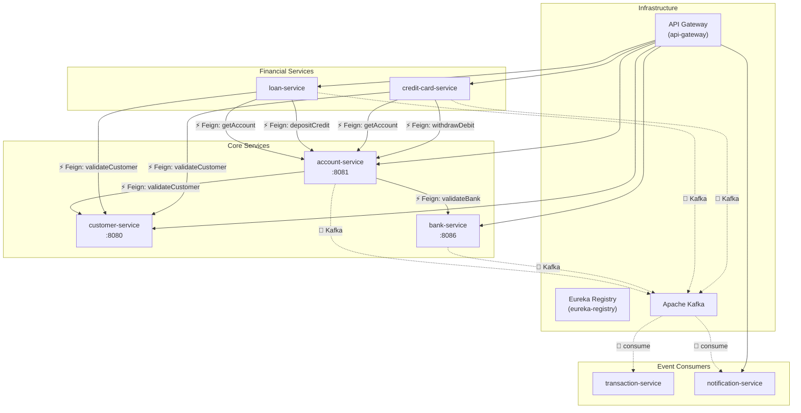

# 🗺️ Service Interaction Map — Bank Management System

> **Scope:** Every inter-service method call across all 7 microservices, with communication type clearly marked.

---

## Legend

| Symbol | Meaning |
|--------|---------|
| `──▶ Feign` | Synchronous REST call via OpenFeign |
| `~~▶ Kafka` | Asynchronous event via Kafka topic |
| `⚡` | Direct Feign / REST call |
| `📨` | Kafka event (fire-and-forget, non-critical) |

---

## High-Level Architecture Diagram



---

## 1. 🏦 Account Service (`account-service` — port `:8081`)

### Outgoing Feign Calls (Synchronous / Direct)

| Caller Method | Target Service | Feign Client | Target Endpoint | Purpose |
|---|---|---|---|---|
| `AccountService.getCustomerDetails()` | **customer-service** | `CustomerFeignService.findById(customerId)` | `GET /api/v1/customers/find-by-id` | Validate customer exists before account creation |
| `AccountService.validateAndFetchBank()` | **bank-service** | `BankFeignService.getBankById(bankId)` | `GET /api/v1/banks/{bankId}` | Validate bank exists and is ACTIVE before linking |

### Outgoing Kafka Events (Asynchronous)

| Producer Method | Kafka Topic | Event Class | Consumer Service | Consumer Method |
|---|---|---|---|---|
| `createAccount()` | `transaction-topic` | `TransactionEvent` | **transaction-service** | `recordTransaction()` |
| `createAccount()` | `account-creation-topic` | `AccountCreationEvent` | **notification-service** | `handleAccountCreationEvent()` |
| `depositCredit()` | `transaction-notification-topic` | `TransactionNotificationEvent` | **notification-service** | `handleTransactionNotificationEvent()` |
| `depositCredit()` | `transaction-payment-topic` | `TransactionEvent` | **transaction-service** | `recordTransactionForDepositOrWithdrawal()` |
| `withdrawDebit()` | `transaction-notification-topic` | `TransactionNotificationEvent` | **notification-service** | `handleTransactionNotificationEvent()` |
| `withdrawDebit()` | `transaction-payment-topic` | `TransactionEvent` | **transaction-service** | `recordTransactionForDepositOrWithdrawal()` |
| `transferAmount()` | `transaction-notification-topic` | `TransactionNotificationEvent` (×2: source + dest) | **notification-service** | `handleTransactionNotificationEvent()` |
| `transferAmount()` | `transaction-payment-topic` | `TransactionEvent` | **transaction-service** | `recordTransactionForDepositOrWithdrawal()` |

### REST API Endpoints (Exposed — called by other services via Feign)

| Endpoint | HTTP | Called By |
|---|---|---|
| `GET /api/v1/accounts/get-account-by-account-number` | GET | **loan-service** (`AccountFeignService`), **credit-card-service** (`AccountFeignService`) |
| `PUT /api/v1/accounts/{accountNumber}/depositCredit` | PUT | **loan-service** (`AccountFeignService.depositCredit()`) |
| `PUT /api/v1/accounts/{accountNumber}/withdrawDebit` | PUT | **credit-card-service** (`AccountFeignService.withdrawDebit()`) |

### Internal Method Call Chain

```
createAccount()
├── getCustomerDetails()           ── ⚡ Feign → customer-service
├── validateAndFetchBank()         ── ⚡ Feign → bank-service
├── generateAccountNumber()
├── accountRepository.save()
├── createTransactionEvent()       ── 📨 Kafka → transaction-topic
└── AccountCreationEvent           ── 📨 Kafka → account-creation-topic

depositCredit()
├── insertIdempotencyKey()
├── getAccountEntity()
├── accountRepository.save()
├── sendTransactionNotification()  ── 📨 Kafka → transaction-notification-topic
└── paymentTransaction()           ── 📨 Kafka → transaction-payment-topic

withdrawDebit()
├── insertIdempotencyKey()
├── getAccountEntity()
├── accountRepository.save()
├── sendTransactionNotification()  ── 📨 Kafka → transaction-notification-topic
└── paymentTransaction()           ── 📨 Kafka → transaction-payment-topic

transferAmount()
├── insertIdempotencyKey()
├── getAccountEntity() (source)
├── getAccountEntity() (destination)
├── accountRepository.save() (×2)
├── sendTransactionNotification()  ── 📨 Kafka → transaction-notification-topic (×2)
└── paymentTransaction()           ── 📨 Kafka → transaction-payment-topic
```

---

## 2. 🏛️ Bank Service (`bank-service` — port `:8086`)

### Outgoing Feign Calls
> **None.** Bank service has no Feign clients — it is a standalone data service.

### Outgoing Kafka Events

| Producer Method | Kafka Topic | Event Class | Consumer |
|---|---|---|---|
| `registerBank()` → `publishRegistrationEvent()` | `bank-registration-topic` | `Map<String, Object>` | *(no consumer currently wired)* |

### REST API Endpoints (Exposed)

| Endpoint | HTTP | Called By |
|---|---|---|
| `GET /api/v1/banks/{bankId}` | GET | **account-service** (`BankFeignService.getBankById()`) |

### Internal Method Call Chain

```
registerBank()
├── bankRepository.existsByBankCode()
├── bankRepository.save()
└── publishRegistrationEvent()     ── 📨 Kafka → bank-registration-topic
```

---

## 3. 👤 Customer Service (`customer-service` — port `:8080`)

### Outgoing Feign Calls
> **None.** Customer service has no Feign clients — it is a standalone data service.

### Outgoing Kafka Events
> **None.** Customer service does not publish any Kafka events.

### REST API Endpoints (Exposed — consumed by 3 services)

| Endpoint | HTTP | Called By |
|---|---|---|
| `GET /api/v1/customers/find-by-id` | GET | **account-service** (`CustomerFeignService`), **loan-service** (`CustomerFeignService`), **credit-card-service** (`CustomerFeignService`) |

### Internal Method Call Chain

```
findById()          ── purely local DB lookup
createCustomer()    ── purely local DB insert
updateCustomer()    ── purely local DB update
deleteCustomer()    ── purely local DB delete
findAllCustomers()  ── purely local DB query (paginated)
findByEmail()       ── purely local DB lookup
```

---

## 4. 💰 Loan Service (`loan-service`)

### Outgoing Feign Calls (Synchronous / Direct)

| Caller Method | Target Service | Feign Client | Target Endpoint | Purpose |
|---|---|---|---|---|
| `applyLoan()` → `getCustomerDetails()` | **customer-service** | `CustomerFeignService.findById(customerId)` | `GET /api/v1/customers/find-by-id` | Validate customer exists |
| `applyLoan()` → `getAccountDetails()` | **account-service** | `AccountFeignService.getAccountByAccountNumber(acctNo)` | `GET /api/v1/accounts/get-account-by-account-number` | Validate account exists & ownership |
| `disburseLoan()` | **account-service** | `AccountFeignService.depositCredit(idempotencyKey, acctNo, amount)` | `PUT /api/v1/accounts/{accountNumber}/depositCredit` | Credit loan amount to customer account |

### Outgoing Kafka Events

| Producer Method | Kafka Topic | Event Class | Consumer Service | Consumer Method |
|---|---|---|---|---|
| `applyLoan()` → `sendApplicationEvent()` | `loan-application-topic` | `LoanApplicationEvent` | **notification-service** | `handleLoanApplicationEvent()` |
| `approveLoan()` → `sendStatusEvent()` | `loan-status-topic` | `LoanStatusEvent` | **notification-service** | `handleLoanStatusEvent()` |
| `rejectLoan()` → `sendStatusEvent()` | `loan-status-topic` | `LoanStatusEvent` | **notification-service** | `handleLoanStatusEvent()` |
| `disburseLoan()` → `sendDisbursementEvent()` | `loan-disbursement-topic` | `LoanDisbursementEvent` | **notification-service** | `handleLoanDisbursementEvent()` |

### Internal Method Call Chain

```
applyLoan()
├── getCustomerDetails()           ── ⚡ Feign → customer-service
├── getAccountDetails()            ── ⚡ Feign → account-service
├── Cross-validate ownership
├── loanRepository.save()
└── sendApplicationEvent()         ── 📨 Kafka → loan-application-topic

approveLoan()
├── fetchLoan()
├── validateStatus(PENDING)
├── calculateEMI()
├── loanRepository.save()
└── sendStatusEvent("APPROVED")    ── 📨 Kafka → loan-status-topic

rejectLoan()
├── fetchLoan()
├── validateStatus(PENDING)
├── loanRepository.save()
└── sendStatusEvent("REJECTED")    ── 📨 Kafka → loan-status-topic

disburseLoan()
├── fetchLoan()
├── validateStatus(APPROVED)
├── EMI safety check
├── accountFeignService.depositCredit()  ── ⚡ Feign → account-service
├── loanRepository.save()
└── sendDisbursementEvent()        ── 📨 Kafka → loan-disbursement-topic
```

---

## 5. 💳 Credit Card Service (`credit-card-service`)

### Outgoing Feign Calls (Synchronous / Direct)

| Caller Method | Target Service | Feign Client | Target Endpoint | Purpose |
|---|---|---|---|---|
| `applyCard()` → `fetchCustomer()` | **customer-service** | `CustomerFeignService.findById(customerId)` | `GET /api/v1/customers/find-by-id` | Validate customer exists |
| `applyCard()` → `fetchAccount()` | **account-service** | `AccountFeignService.getAccountByAccountNumber(acctNo)` | `GET /api/v1/accounts/get-account-by-account-number` | Validate account exists & ownership |
| `makePayment()` | **account-service** | `AccountFeignService.withdrawDebit(idempotencyKey, acctNo, amount)` | `PUT /api/v1/accounts/{accountNumber}/withdrawDebit` | Debit payment from linked bank account |

### Outgoing Kafka Events

| Producer Method | Kafka Topic | Event Class | Consumer Service | Consumer Method |
|---|---|---|---|---|
| `applyCard()` → `publishApplicationEvent()` | `credit-card-application-topic` | `CreditCardApplicationEvent` | **notification-service** | `handleCreditCardApplicationEvent()` |
| `approveCard()` → `publishStatusEvent()` | `credit-card-status-topic` | `CreditCardStatusEvent` | **notification-service** | `handleCreditCardStatusEvent()` |
| `rejectCard()` → `publishStatusEvent()` | `credit-card-status-topic` | `CreditCardStatusEvent` | **notification-service** | `handleCreditCardStatusEvent()` |
| `activateCard()` → `publishStatusEvent()` | `credit-card-status-topic` | `CreditCardStatusEvent` | **notification-service** | `handleCreditCardStatusEvent()` |
| `blockCard()` → `publishStatusEvent()` | `credit-card-status-topic` | `CreditCardStatusEvent` | **notification-service** | `handleCreditCardStatusEvent()` |
| `unblockCard()` → `publishStatusEvent()` | `credit-card-status-topic` | `CreditCardStatusEvent` | **notification-service** | `handleCreditCardStatusEvent()` |
| `closeCard()` → `publishStatusEvent()` | `credit-card-status-topic` | `CreditCardStatusEvent` | **notification-service** | `handleCreditCardStatusEvent()` |
| `chargeCard()` → `publishTransactionEvent()` | `credit-card-transaction-topic` | `CreditCardTransactionEvent` | **notification-service** | `handleCreditCardTransactionEvent()` |
| `makePayment()` → `publishTransactionEvent()` | `credit-card-transaction-topic` | `CreditCardTransactionEvent` | **notification-service** | `handleCreditCardTransactionEvent()` |
| `makePayment()` → `publishPaymentToTransactionService()` | `transaction-payment-topic` | `TransactionEvent` | **transaction-service** | `recordTransactionForDepositOrWithdrawal()` |

### Internal Method Call Chain

```
applyCard()
├── fetchCustomer()                       ── ⚡ Feign → customer-service
├── fetchAccount()                        ── ⚡ Feign → account-service
├── Cross-validate ownership
├── generateMaskedCardNumber()
├── creditCardRepository.save()
└── publishApplicationEvent()             ── 📨 Kafka → credit-card-application-topic

approveCard() / rejectCard() / activateCard() / blockCard() / unblockCard() / closeCard()
├── fetchCard()
├── validateStatus()
├── creditCardRepository.save()
└── publishStatusEvent()                  ── 📨 Kafka → credit-card-status-topic

chargeCard()
├── fetchCard()
├── validateStatus(ACTIVE)
├── Check available limit
├── creditCardRepository.save()
└── publishTransactionEvent("CHARGE")     ── 📨 Kafka → credit-card-transaction-topic

makePayment()
├── fetchCard()
├── accountFeignService.withdrawDebit()   ── ⚡ Feign → account-service
├── creditCardRepository.save()
├── publishTransactionEvent("PAYMENT")    ── 📨 Kafka → credit-card-transaction-topic
└── publishPaymentToTransactionService()  ── 📨 Kafka → transaction-payment-topic
```

---

## 6. 📋 Transaction Service (`transaction-service`)

### Outgoing Calls
> **None.** Transaction service is a pure Kafka consumer — no outgoing Feign or Kafka calls.

### Incoming Kafka Events (Consumed)

| Kafka Topic | Consumer Method | Producing Service(s) | Event Class |
|---|---|---|---|
| `transaction-topic` | `recordTransaction()` | **account-service** (on `createAccount`) | `TransactionEvent` |
| `transaction-payment-topic` | `recordTransactionForDepositOrWithdrawal()` | **account-service** (deposit/withdraw/transfer), **credit-card-service** (payment) | `TransactionEvent` |

### Internal Method Call Chain

```
recordTransaction()
└── processTransactionEvent()
    └── transactionRepository.save()

recordTransactionForDepositOrWithdrawal()
└── processTransactionEvent()
    └── transactionRepository.save()
```

---

## 7. 🔔 Notification Service (`notification-service`)

### Outgoing Calls
> **None.** Notification service is a pure Kafka consumer — no outgoing Feign or Kafka calls.

### Incoming Kafka Events (Consumed — 8 listeners)

| # | Kafka Topic | Consumer Method | Producing Service | Event Class |
|---|---|---|---|---|
| 1 | `account-creation-topic` | `handleAccountCreationEvent()` | **account-service** | `AccountCreationEvent` |
| 2 | `transaction-notification-topic` | `handleTransactionNotificationEvent()` | **account-service** | `TransactionNotificationEvent` |
| 3 | `loan-application-topic` | `handleLoanApplicationEvent()` | **loan-service** | `LoanApplicationEvent` |
| 4 | `loan-status-topic` | `handleLoanStatusEvent()` | **loan-service** | `LoanStatusEvent` |
| 5 | `loan-disbursement-topic` | `handleLoanDisbursementEvent()` | **loan-service** | `LoanDisbursementEvent` |
| 6 | `credit-card-application-topic` | `handleCreditCardApplicationEvent()` | **credit-card-service** | `CreditCardApplicationEvent` |
| 7 | `credit-card-status-topic` | `handleCreditCardStatusEvent()` | **credit-card-service** | `CreditCardStatusEvent` |
| 8 | `credit-card-transaction-topic` | `handleCreditCardTransactionEvent()` | **credit-card-service** | `CreditCardTransactionEvent` |

---

## 📊 Complete Kafka Topic Registry

| # | Topic Name | Producer(s) | Consumer(s) |
|---|---|---|---|
| 1 | `account-creation-topic` | account-service | notification-service |
| 2 | `transaction-topic` | account-service | transaction-service |
| 3 | `transaction-payment-topic` | account-service, credit-card-service | transaction-service |
| 4 | `transaction-notification-topic` | account-service | notification-service |
| 5 | `bank-registration-topic` | bank-service | *(none currently wired)* |
| 6 | `loan-application-topic` | loan-service | notification-service |
| 7 | `loan-status-topic` | loan-service | notification-service |
| 8 | `loan-disbursement-topic` | loan-service | notification-service |
| 9 | `credit-card-application-topic` | credit-card-service | notification-service |
| 10 | `credit-card-status-topic` | credit-card-service | notification-service |
| 11 | `credit-card-transaction-topic` | credit-card-service | notification-service |

---

## 🔗 Service Dependency Matrix

> **Rows** depend on **Columns** (✓ = direct Feign call, 📨 = Kafka only)

| Service ↓ Depends On → | customer | account | bank | loan | credit-card | transaction | notification |
|---|---|---|---|---|---|---|---|
| **customer-service** | — | | | | | | |
| **account-service** | ✓ Feign | — | ✓ Feign | | | 📨 Kafka | 📨 Kafka |
| **bank-service** | | | — | | | | 📨 Kafka* |
| **loan-service** | ✓ Feign | ✓ Feign | | — | | | 📨 Kafka |
| **credit-card-service** | ✓ Feign | ✓ Feign | | | — | 📨 Kafka | 📨 Kafka |
| **transaction-service** | | | | | | — | |
| **notification-service** | | | | | | | — |

*\* bank-registration-topic has no consumer wired yet*

---

## 🔄 End-to-End Flow Examples

### Example 1: Account Creation Flow
```
Client → POST /api/v1/accounts/create-account
    │
    ├── ⚡ Feign → customer-service: GET /api/v1/customers/find-by-id
    ├── ⚡ Feign → bank-service:     GET /api/v1/banks/{bankId}
    ├── 💾 Save account to DB
    ├── 📨 Kafka → transaction-topic            → transaction-service saves record
    └── 📨 Kafka → account-creation-topic       → notification-service saves notification
```

### Example 2: Loan Disbursement Flow
```
Client → PUT /api/v1/loans/{loanId}/disburse
    │
    ├── 💾 Fetch loan from DB
    ├── ⚡ Feign → account-service: PUT /{accountNumber}/depositCredit
    │       │
    │       ├── 💾 Account balance updated
    │       ├── 📨 Kafka → transaction-notification-topic → notification-service
    │       └── 📨 Kafka → transaction-payment-topic      → transaction-service
    │
    ├── 💾 Loan status → ACTIVE
    └── 📨 Kafka → loan-disbursement-topic                → notification-service
```

### Example 3: Credit Card Payment Flow
```
Client → POST /api/v1/credit-cards/{cardId}/payment
    │
    ├── 💾 Fetch card from DB
    ├── ⚡ Feign → account-service: PUT /{accountNumber}/withdrawDebit
    │       │
    │       ├── 💾 Account balance debited
    │       ├── 📨 Kafka → transaction-notification-topic → notification-service
    │       └── 📨 Kafka → transaction-payment-topic      → transaction-service
    │
    ├── 💾 Card outstanding balance reduced
    ├── 📨 Kafka → credit-card-transaction-topic          → notification-service
    └── 📨 Kafka → transaction-payment-topic              → transaction-service
```
