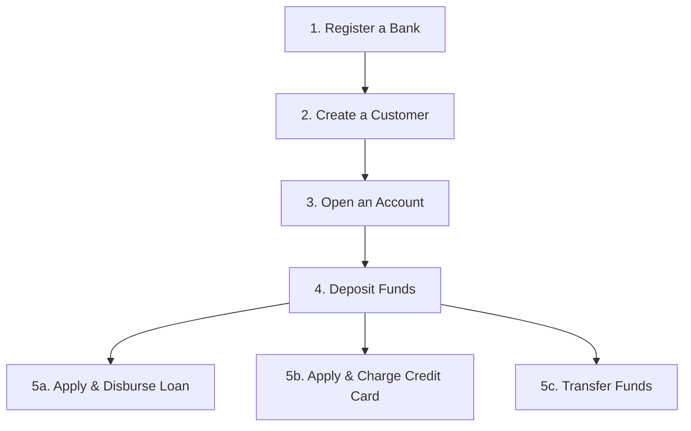

# 🏦 Banking Microservice Ecosystem - Postman Testing Guide

This guide provides step-by-step instructions, sample requests, and payloads to test all API endpoints of the banking microservice ecosystem.

---

## 🚀 Port Registry & Base URLs

If you are running the microservices locally, they are accessible at the following base URLs:

| Service Name | Default Port | Base URL |
| :--- | :---: | :--- |
| **Customer Service** | `8080` | `http://localhost:8080/api/v1/customers` |
| **Account Service** | `8081` | `http://localhost:8081/api/v1/accounts` |
| **Transaction Service** | `8083` | `http://localhost:8083/api/v1/transactions` |
| **Loan Service** | `8084` | `http://localhost:8084/api/v1/loans` |
| **Credit Card Service** | `8085` | `http://localhost:8085/api/v1/credit-cards` |
| **Bank Service** | `8086` | `http://localhost:8086/api/v1/banks` |

---

## 🛠️ Complete End-to-End Testing Workflow

To test the system correctly, follow this logical sequence since the services are highly integrated (e.g., an account needs a Customer and a Bank; a Loan/Credit Card needs an Account).



---

## 1. 🏢 Bank Service (`port: 8086`)
Handles bank registration and operational status.

### 1.1 Register a Bank
* **Method:** `POST`
* **Path:** `/api/v1/banks/register`
* **Headers:** `Content-Type: application/json`
* **Request Body:**
```json
{
  "bankName": "First National Bank",
  "bankCode": "FNBK",
  "headquartersCity": "New York",
  "ifscPrefix": "FNBK",
  "contactEmail": "info@fnbk.com",
  "contactPhone": "1800123456"
}
```
* **Response (201 Created):**
```json
{
  "bankId": "3fa85f64-5717-4562-b3fc-2c963f66afa6",
  "bankName": "First National Bank",
  "bankCode": "FNBK",
  "headquartersCity": "New York",
  "ifscPrefix": "FNBK",
  "contactEmail": "info@fnbk.com",
  "contactPhone": "1800123456",
  "bankStatus": "ACTIVE",
  "createdAt": "2026-05-20T07:42:15",
  "updatedAt": "2026-05-20T07:42:15"
}
```

### 1.2 Get Bank by ID
* **Method:** `GET`
* **Path:** `/api/v1/banks/{bankId}` (Replace `{bankId}` with UUID from registration)

### 1.3 Get Bank by Short Code
* **Method:** `GET`
* **Path:** `/api/v1/banks/code/FNBK`

### 1.4 List All Registered Banks
* **Method:** `GET`
* **Path:** `/api/v1/banks`

### 1.5 Update Bank Operational Status
* **Method:** `PUT`
* **Path:** `/api/v1/banks/{bankId}/status`
* **Query Parameters:** `status=SUSPENDED` (Valid values: `ACTIVE`, `SUSPENDED`, `CLOSED`)

### 1.6 Delete Bank Record
* **Method:** `DELETE`
* **Path:** `/api/v1/banks/{bankId}`

---

## 2. 👥 Customer Service (`port: 8080`)
Handles user profiles and authentication details.

### 2.1 Create a Customer
* **Method:** `POST`
* **Path:** `/api/v1/customers/create-customer`
* **Headers:** `Content-Type: application/json`
* **Request Body:**
```json
{
  "firstName": "Sanket",
  "lastName": "Jaisingpure",
  "email": "sanket@example.com",
  "passwordHash": "securepassword123",
  "mobileNumber": "9876543210"
}
```

### 2.2 Get Customer by ID
* **Method:** `GET`
* **Path:** `/api/v1/customers/find-by-id`
* **Query Parameters:** `customerId=3fa85f64-5717-4562-b3fc-2c963f66afa6`

### 2.3 Get Customer by Email
* **Method:** `GET`
* **Path:** `/api/v1/customers/find-by-email`
* **Query Parameters:** `email=sanket@example.com`

### 2.4 Update Customer Info
* **Method:** `POST`
* **Path:** `/api/v1/customers/update-customer`
* **Headers:** `Content-Type: application/json`
* **Request Body:**
```json
{
  "firstName": "Sanket",
  "lastName": "Jaising",
  "email": "sanket@example.com",
  "mobileNumber": "9999999999"
}
```

### 2.5 Find All Customers (With Pagination)
* **Method:** `GET`
* **Path:** `/api/v1/customers/find-all-customers`
* **Query Parameters:** 
  * `pageNumber=0` (optional, default: 0)
  * `pageSize=10` (optional, default: 10)
  * `sort=firstName` (optional, default: firstName)
  * `order=asc` (optional, default: asc)

### 2.6 Delete Customer
* **Method:** `DELETE`
* **Path:** `/api/v1/customers/delete-customer`
* **Query Parameters:** `customerId=3fa85f64-5717-4562-b3fc-2c963f66afa6`

---

## 3. 💳 Account Service (`port: 8081`)
Manages deposit accounts, balances, and financial transactions.

### 3.1 Open a New Account
> [!IMPORTANT]
> `bankId` must belong to a registered `ACTIVE` bank, and `customerId` must belong to an existing customer.

* **Method:** `POST`
* **Path:** `/api/v1/accounts/create-account`
* **Headers:** `Content-Type: application/json`
* **Request Body:**
```json
{
  "customerId": "CUSTOMER_UUID_HERE",
  "accountType": "SAVINGS", 
  "ifscCode": "FNBK0000001",
  "branchName": "Downtown Manhattan",
  "balance": 5000.00,
  "bankId": "BANK_UUID_HERE"
}
```
*(Valid `accountType` values: `SAVINGS`, `CURRENT`, `FIXED_DEPOSIT`)*

### 3.2 Get Account by Account Number
* **Method:** `GET`
* **Path:** `/api/v1/accounts/get-account-by-account-number`
* **Query Parameters:** `accountNumber=ACC_NUMBER_HERE`

### 3.3 Get All Accounts by Customer ID
* **Method:** `GET`
* **Path:** `/api/v1/accounts/get-all-accounts-by-customer-id`
* **Query Parameters:** `customerId=CUSTOMER_UUID_HERE`

### 3.4 Get Account by Account ID
* **Method:** `GET`
* **Path:** `/api/v1/accounts/get-account-by-Id`
* **Query Parameters:** `accountId=ACCOUNT_UUID_HERE`

### 3.5 Check Balance
* **Method:** `GET`
* **Path:** `/api/v1/accounts/get-balance`
* **Query Parameters:** `accountNumber=ACC_NUMBER_HERE`

### 3.6 Deposit Funds (Credit)
> [!NOTE]
> All mutations in account-service (Deposit, Withdraw, Transfer) require a unique UUID header `Idempotency-key` to prevent duplicate transaction execution on network retries.

* **Method:** `PUT`
* **Path:** `/api/v1/accounts/{accountNumber}/depositCredit` (Replace `{accountNumber}`)
* **Headers:** 
  * `Idempotency-key: UNIQUE_UUID_HERE` (Generate a new UUID for each transaction)
* **Query Parameters:** `amount=2000.00`

### 3.7 Withdraw Funds (Debit)
* **Method:** `PUT`
* **Path:** `/api/v1/accounts/{accountNumber}/withdrawDebit` (Replace `{accountNumber}`)
* **Headers:** 
  * `Idempotency-key: UNIQUE_UUID_HERE`
* **Query Parameters:** `amount=500.00`

### 3.8 Transfer Amount (To another Account)
* **Method:** `PUT`
* **Path:** `/api/v1/accounts/transfer-amount`
* **Headers:** 
  * `Idempotency-key: UNIQUE_UUID_HERE`
  * `Content-Type: application/json`
* **Request Body:**
```json
{
  "sourceAccountNumber": "SRC_ACC_NUMBER_HERE",
  "destinationAccountNumber": "DEST_ACC_NUMBER_HERE",
  "amount": 1500.00
}
```

### 3.9 Update Account Status
* **Method:** `PUT`
* **Path:** `/api/v1/accounts/update-status`
* **Query Parameters:** 
  * `accountNumber=ACC_NUMBER_HERE`
  * `status=BLOCKED` (Valid values: `ACTIVE`, `INACTIVE`, `BLOCKED`, `CLOSED`)

### 3.10 Delete Account
* **Method:** `DELETE`
* **Path:** `/api/v1/accounts/delete-account-by-Id`
* **Query Parameters:** `accountId=ACCOUNT_UUID_HERE`

---

## 4. 📈 Loan Service (`port: 8084`)
Manages loan requests, EMIs, approvals, and disbursements.

### 4.1 Apply for a Loan
* **Method:** `POST`
* **Path:** `/api/v1/loans/apply`
* **Headers:** `Content-Type: application/json`
* **Request Body:**
```json
{
  "customerId": "CUSTOMER_UUID_HERE",
  "accountNumber": "ACC_NUMBER_HERE",
  "loanAmount": 100000.00,
  "tenureMonths": 12
}
```

### 4.2 Approve Loan (Calculates EMI)
* **Method:** `PUT`
* **Path:** `/api/v1/loans/{loanId}/approve` (Replace `{loanId}`)
* **Response:** Calculates the EMI amount based on the default rate (`12.5%`) and changes the status to `APPROVED`.

### 4.3 Reject Loan
* **Method:** `PUT`
* **Path:** `/api/v1/loans/{loanId}/reject` (Replace `{loanId}`)

### 4.4 Disburse Loan (Credits Loan Amount to Linked Account)
* **Method:** `PUT`
* **Path:** `/api/v1/loans/{loanId}/disburse` (Replace `{loanId}`)
* **Effect:** Automatically triggers a deposit into the linked `accountNumber` with the loan amount and transitions status to `ACTIVE`.

### 4.5 Get Loan Details
* **Method:** `GET`
* **Path:** `/api/v1/loans/{loanId}`

---

## 5. 💳 Credit Card Service (`port: 8085`)
Manages credit cards, limits, payments, and charges.

### 5.1 Apply for a Credit Card
* **Method:** `POST`
* **Path:** `/api/v1/credit-cards/apply`
* **Headers:** `Content-Type: application/json`
* **Request Body:**
```json
{
  "customerId": "CUSTOMER_UUID_HERE",
  "accountNumber": "ACC_NUMBER_HERE"
}
```

### 5.2 Approve Credit Card Application
* **Method:** `PUT`
* **Path:** `/api/v1/credit-cards/{cardId}/approve`

### 5.3 Reject Credit Card Application
* **Method:** `PUT`
* **Path:** `/api/v1/credit-cards/{cardId}/reject`

### 5.4 Activate Credit Card
* **Method:** `PUT`
* **Path:** `/api/v1/credit-cards/{cardId}/activate`

### 5.5 Block Credit Card
* **Method:** `PUT`
* **Path:** `/api/v1/credit-cards/{cardId}/block`

### 5.6 Unblock Credit Card
* **Method:** `PUT`
* **Path:** `/api/v1/credit-cards/{cardId}/unblock`

### 5.7 Close Credit Card
> [!WARNING]
> A credit card can only be closed if its outstanding balance is exactly `0.00`.

* **Method:** `PUT`
* **Path:** `/api/v1/credit-cards/{cardId}/close`

### 5.8 Make a Purchase / Charge Card
* **Method:** `POST`
* **Path:** `/api/v1/credit-cards/{cardId}/charge`
* **Headers:** `Content-Type: application/json`
* **Request Body:**
```json
{
  "amount": 250.00,
  "description": "Amazon Purchase"
}
```

### 5.9 Make Bill Payment (Pays down Outstanding Balance)
* **Method:** `POST`
* **Path:** `/api/v1/credit-cards/{cardId}/payment`
* **Headers:** `Content-Type: application/json`
* **Request Body:**
```json
{
  "amount": 250.00,
  "description": "Monthly Credit Card Payment"
}
```

### 5.10 Get Credit Card Details by Card ID
* **Method:** `GET`
* **Path:** `/api/v1/credit-cards/{cardId}`

### 5.11 Get All Credit Cards of a Customer
* **Method:** `GET`
* **Path:** `/api/v1/credit-cards/customer/{customerId}`

---

## 6. 📊 Sample Valid Test Data

### 6.1 Bank Service Sample Data

```json
{
  "bankName": "State Bank of India",
  "bankCode": "SBIN",
  "headquartersCity": "Mumbai",
  "ifscPrefix": "SBIN",
  "contactEmail": "contact@sbi.co.in",
  "contactPhone": "1800112211"
}
```

```json
{
  "bankName": "HDFC Bank",
  "bankCode": "HDFC",
  "headquartersCity": "Mumbai",
  "ifscPrefix": "HDFC",
  "contactEmail": "support@hdfcbank.com",
  "contactPhone": "18002586181"
}
```

```json
{
  "bankName": "ICICI Bank",
  "bankCode": "ICIC",
  "headquartersCity": "Mumbai",
  "ifscPrefix": "ICIC",
  "contactEmail": "customer.care@icicibank.com",
  "contactPhone": "18001090900"
}
```

### 6.2 Customer Service Sample Data

```json
{
  "firstName": "Rahul",
  "lastName": "Sharma",
  "email": "rahul.sharma@example.com",
  "passwordHash": "SecurePass@123",
  "mobileNumber": "9876543210"
}
```

```json
{
  "firstName": "Priya",
  "lastName": "Patel",
  "email": "priya.patel@example.com",
  "passwordHash": "MySecure@456",
  "mobileNumber": "9876543211"
}
```

```json
{
  "firstName": "Amit",
  "lastName": "Kumar",
  "email": "amit.kumar@example.com",
  "passwordHash": "StrongPass@789",
  "mobileNumber": "9876543212"
}
```

### 6.3 Account Service Sample Data

```json
{
  "customerId": "CUSTOMER_UUID_HERE",
  "accountType": "SAVINGS",
  "ifscCode": "SBIN0001234",
  "branchName": "Connaught Place, New Delhi",
  "balance": 50000.00,
  "bankId": "BANK_UUID_HERE"
}
```

```json
{
  "customerId": "CUSTOMER_UUID_HERE",
  "accountType": "CURRENT",
  "ifscCode": "HDFC0005678",
  "branchName": "Bandra West, Mumbai",
  "balance": 100000.00,
  "bankId": "BANK_UUID_HERE"
}
```

```json
{
  "customerId": "CUSTOMER_UUID_HERE",
  "accountType": "FIXED_DEPOSIT",
  "ifscCode": "ICIC0009012",
  "branchName": "Koramangala, Bangalore",
  "balance": 500000.00,
  "bankId": "BANK_UUID_HERE"
}
```

### 6.4 Loan Service Sample Data

```json
{
  "customerId": "CUSTOMER_UUID_HERE",
  "accountNumber": "ACC_NUMBER_HERE",
  "loanAmount": 500000.00,
  "tenureMonths": 24
}
```

```json
{
  "customerId": "CUSTOMER_UUID_HERE",
  "accountNumber": "ACC_NUMBER_HERE",
  "loanAmount": 1000000.00,
  "tenureMonths": 36
}
```

```json
{
  "customerId": "CUSTOMER_UUID_HERE",
  "accountNumber": "ACC_NUMBER_HERE",
  "loanAmount": 250000.00,
  "tenureMonths": 12
}
```

### 6.5 Credit Card Service Sample Data

```json
{
  "customerId": "CUSTOMER_UUID_HERE",
  "accountNumber": "ACC_NUMBER_HERE"
}
```

### 6.6 Transaction Sample Data

**Deposit Request:**
- Amount: `15000.00`
- Idempotency-key: `550e8400-e29b-41d4-a716-446655440000`

**Withdraw Request:**
- Amount: `5000.00`
- Idempotency-key: `550e8400-e29b-41d4-a716-446655440001`

**Transfer Request:**
```json
{
  "sourceAccountNumber": "SRC_ACC_NUMBER_HERE",
  "destinationAccountNumber": "DEST_ACC_NUMBER_HERE",
  "amount": 10000.00
}
```
- Idempotency-key: `550e8400-e29b-41d4-a716-446655440002`

**Credit Card Charge:**
```json
{
  "amount": 5000.00,
  "description": "Electronics Purchase - Flipkart"
}
```

**Credit Card Payment:**
```json
{
  "amount": 3000.00,
  "description": "Monthly Credit Card Bill Payment"
}
```

### 6.7 Complete End-to-End Test Scenario

**Step 1: Register Bank**
```json
{
  "bankName": "Test Bank",
  "bankCode": "TBNK",
  "headquartersCity": "Bangalore",
  "ifscPrefix": "TBNK",
  "contactEmail": "support@testbank.com",
  "contactPhone": "1800999888"
}
```

**Step 2: Create Customer**
```json
{
  "firstName": "Test",
  "lastName": "User",
  "email": "testuser@example.com",
  "passwordHash": "Test@12345",
  "mobileNumber": "9998887776"
}
```

**Step 3: Open Account**
```json
{
  "customerId": "CUSTOMER_UUID_FROM_STEP_2",
  "accountType": "SAVINGS",
  "ifscCode": "TBNK0000001",
  "branchName": "Main Branch, Bangalore",
  "balance": 10000.00,
  "bankId": "BANK_UUID_FROM_STEP_1"
}
```

**Step 4: Deposit Funds**
- Amount: `20000.00`
- Idempotency-key: `unique-uuid-for-deposit`

**Step 5: Apply for Loan**
```json
{
  "customerId": "CUSTOMER_UUID_FROM_STEP_2",
  "accountNumber": "ACCOUNT_NUMBER_FROM_STEP_3",
  "loanAmount": 100000.00,
  "tenureMonths": 12
}
```

**Step 6: Apply for Credit Card**
```json
{
  "customerId": "CUSTOMER_UUID_FROM_STEP_2",
  "accountNumber": "ACCOUNT_NUMBER_FROM_STEP_3"
}
```

---

## 💡 Pro-Tips for Postman Users
1. **Environments:** Create a Postman Environment containing a `baseUrl` variable to easily switch endpoints.
2. **Collection Variables:** Save the returned `customerId`, `bankId`, `accountId`, and `cardId` values into collection variables on successful creation to avoid manual copy-pasting for subsequent requests!
   * Add this to the **Tests** tab of your Postman creation requests to automate variables:
   ```javascript
   const response = pm.response.json();
   if (response.customerId) pm.collectionVariables.set("customerId", response.customerId);
   if (response.bankId) pm.collectionVariables.set("bankId", response.bankId);
   if (response.accountId) pm.collectionVariables.set("accountId", response.accountId);
   if (response.cardId) pm.collectionVariables.set("cardId", response.cardId);
   if (response.accountNumber) pm.collectionVariables.set("accountNumber", response.accountNumber);
   ```
